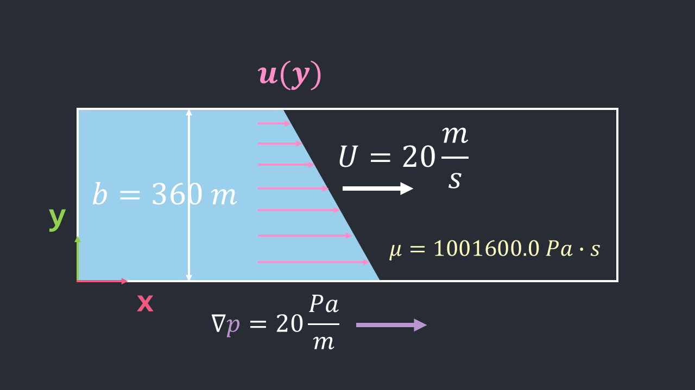

# Navier-Stokes 2D Simulation💧


Welcome to **Navier-Stokes 2D Simulation**, where we flex our brain cells and GPUs to simulate Navier-Stokes equations.

Powered by Rust 🦀 and Bevy 🚀, this project is your gateway to fluid dynamics with vibes.

## 📚 Conditions



- Steady flow.
- Incompressible flow.
- No gravity effects.
- Pressure gradient is exists.
- Boundary conditions are y=[0, b].
- u(y) = U at y=0; u(y) = 0 at y=b.
- Using metric units.

## 📝 Flow Profile

$$
u(y) = \frac{1}{2\mu} \nabla p \left(b^2 - by\right) + U \left(1 - \frac{y}{b}\right)
$$

## 🚀 WASM Demo

https://rayato159.github.io/navier-stokes-simulation/

## 🎯 What's the Vibe?

We're talking 2D fluid sims that are smoother than your morning coffee pour.

- Solves Navier-Stokes equations (yes, the math that makes fluids flow 🧠💦).
- Uses **Rust** for max performance and **Bevy** for stunning visuals.

## 🛠️ Setup: Get Yo' Fluids Flowing

1. Clone the Repo 🖥️

   ```bash
   git clone https://github.com/Rayato159/navier-stokes-simulation.git
   cd navier-stokes-simulation
   ```

2. Run the Simulation 🚀

   ```bash
   cargo run
   ```

3. Key Controls 🎮
   ```text
   Space: Play/Pause the simulation.
   ```

## 💡 Features

- **Real-time 2D fluid simulation**: Smooth and satisfying, like butter on pancakes.
- **Customizable parameters**: Adjust dynamics viscosity, pressure rate, and more.
- **Bevy-powered rendering**: Leverages the ECS magic for clean visuals and top-tier performance.

## 📑 References

- https://www.grc.nasa.gov/www/k-12/airplane/nseqs.html
- https://www.simscale.com/docs/simwiki/numerics-background/what-are-the-navier-stokes-equations/
